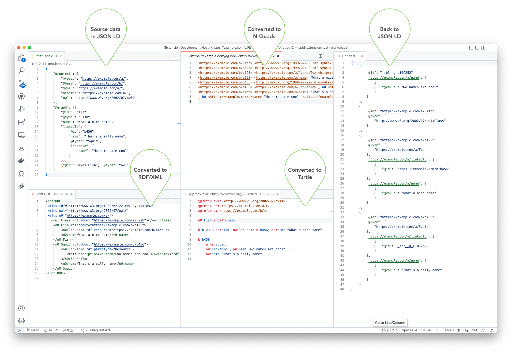
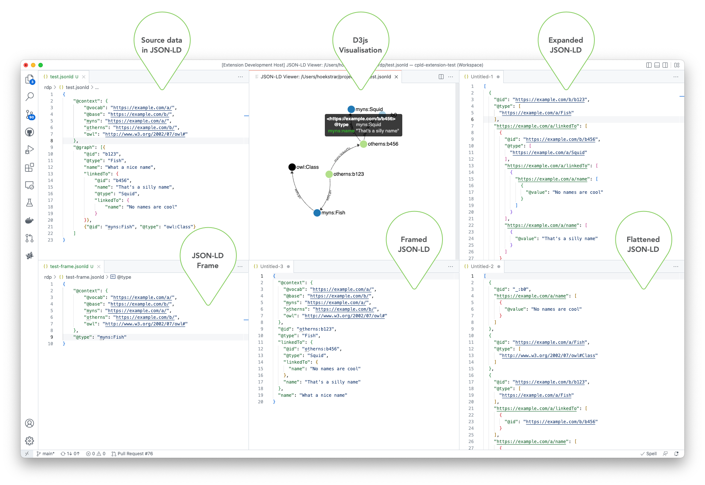
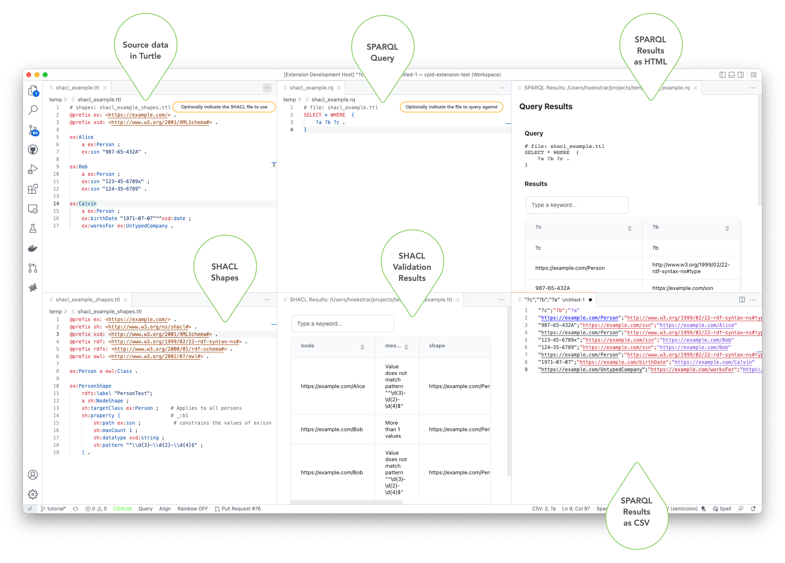

# Linked Data Extension

The Elsevier Data Architecture Linked Data Extension (LDE) for Visual Studio Code brings a number of Linked Data related functionalities to a popular integrated development environment.

It's not industry-grade solid, but should be *good enough™*. For any questions, comments, please contact [Rinke Hoekstra](mailto:r.hoekstra@elsevier.com), or create an issue in the [GitHub repository](https://github.com/elsevierlabs-os/linked-data).

## What it does

* Visualise an RDF graph directly from a file.
* Convert between JSON-LD, Turtle, RDF/XML and N-Quads (some quirks because not every format supports named graphs)
* Convert between JSON-LD variants (compact, expanded, flattened)
* Apply a JSON-LD frame to a JSON-LD file.
* Validate your RDF against a SHACL file
* Run a SPARQL query directly on a file and see the results in HTML and CSV

The JSON-LD operations can work with local context files. This overcomes the limitation in most JSON-LD libraries that interpret context references as URLs. See the `loadLocalContexts` setting below.
 
Download Linked Data Extension from <https://marketplace.visualstudio.com/items?itemName=Elsevier.linked-data> or through the Extensions menu of VSCode.

This extension depends on the [Stardog Languages Extension Pack](https://marketplace.visualstudio.com/items?itemName=stardog-union.vscode-stardog-languages) from Stardog Union for file type recognition, syntax highlighting and syntax checking.
 
## Screenshots

For the files used in the screenshots, see the [examples](examples) folder.

### Conversion Between RDF Formats



### Visualisation and JSON-LD Variants



### SPARQL and SHAQL


## Commands

You can access the commands through the command palette: `Cmd-Shift-p` or `Ctrl-Shift-p` and then start typing "Linked Data", or use one of the following keyboard shortcuts.

### Keyboard Shortcuts

* Standard syntactic JSON-LD operations:
  * `Ctrl-Option-e`/`Ctrl-Alt-e`: Convert a JSON-LD structure to the [expanded document form](https://www.w3.org/TR/json-ld11/#expanded-document-form)
  * `Ctrl-Option-c`/`Ctrl-Alt-c`: Apply `@context` specifications to convert a JSON-LD structure to the [compacted document form](https://www.w3.org/TR/json-ld11/#compacted-document-form). Only works with an included context (not external files)
  * `Ctrl-Option-l`/`Ctrl-Alt-l`: Convert a JSON-LD structure to the [flattened document form](https://www.w3.org/TR/json-ld11/#flattened-document-form)
  * `Ctrl-Option-f`/`Ctrl-Alt-f`: Apply a JSON-LD frame file to convert a JSON-LD structure to the [framed document form](https://www.w3.org/TR/json-ld11/#framed-document-form) using the [framing algorithm](https://www.w3.org/TR/json-ld11-framing/).
* Standard format conversions:
  * `Ctrl-Option-n`/`Ctrl-Alt-n`: Convert an RDF file (any format) to N-Quads
  * `Ctrl-Option-t`/`Ctrl-Alt-t`: Convert an RDF file (any format) to Turtle (may be lossy for files that contain multiple graphs)
  * `Ctrl-Option-r`/`Ctrl-Alt-r`: Convert an RDF file (any format) to RDF/XML (may be lossy for files that contain multiple graphs)
  * `Ctrl-Option-j`/`Ctrl-Alt-j`: Convert an RDF file (any format) to JSON-LD
* View as a Graph:
  * `Ctrl-Option-g`/`Ctrl-Alt-g`: Render an RDF file as a D3js force directed graph.
* Validate against SHACL shapes:
  * `Ctrl-Option-v`/`Ctrl-Alt-v`: Validate an RDF file against SHACL shapes (see below)
* Query a Graph:
  * `Ctrl-Option-q`/`Ctrl-Alt-q`: Run the SPARQL query against an RDF file (see below)

## Extension Settings

This extension contributes the following settings:

* `linked-data.loadLocalContexts`: Should the extension try to load local (non-URI) JSON-LD context files. This is especially useful when testing large context files that are intended to be shared across multiple JSON-LD files. It overcomes the problem that JSON-LD libraries interpret references to contexts as URIs, which would require running an HTTP server to test the context.

## Tips and Recommendations

### SHACL Validator
The SHACL Validator can be told what shapes file to use, by adding commented lines to the top of a Turtle file (does not work for JSON-LD) that refer to a (relative path) to the shapes file using the `shapes` attribute, e.g. the following will try to load the `my_excellent_shapes.ttl` file.

```
# shapes: my_excellent_shapes.ttl
@prefix ex: <https://example.com/> .

ex:Alice
	a ex:Person ;
	ex:ssn "987-65-432A" .
```

If there is no such instruction, or the instruction cannot be parsed as YAML, the extension will show a file open window for you to select the shapes file to use. 


### SPARQL Query
You can run a SPARQL Query only from valid SPARQL files (`*.rq`), and similar to the SHACL validator, you can specify the file against which you want to run the query by using the `file` attribute:

```
# file: example-1-transformed/source.json
SELECT * WHERE  {
    ?a ?b ?c .
}
```

If there is no such instruction, or the instruction cannot be parsed as YAMLM, the extension will show a file open window for you to select the RDF file to query against.

SPARQL results are shown both as a web view with a table that supports sorting and search, as well as a CSV file for further processing.

## Known Limitations

* RDF format support is limited to the underlying libraries. E.g RDF/XML support is spotty as it doesn't deal with XML entity definitions very well.

## Thanks go to:

* Stardog VSCode Extensions, <https://github.com/stardog-union/stardog-vsc>
* rdflib.js, <https://github.com/linkeddata/rdflib.js/>
* Zazuko's SHACL validator, <https://github.com/zazuko/rdf-validate-shacl>
* Google's Schemarama, <https://github.com/google/schemarama>
* d3js, <https://d3js.org>
* ... and many others.